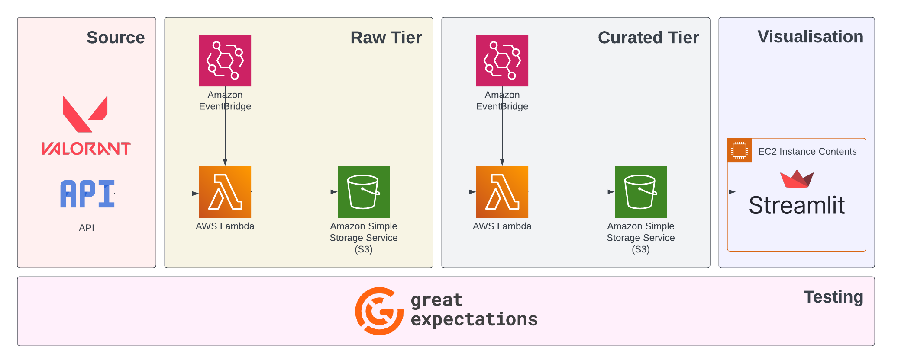
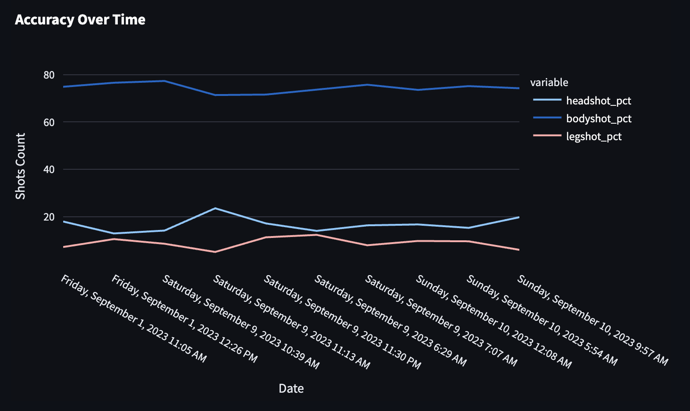
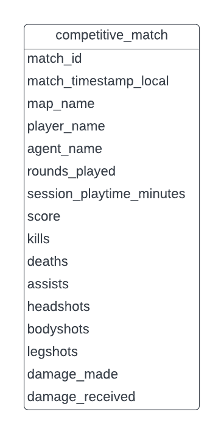

  

# Valorant Match Data Pipeline

This project contains an end-to-end AWS data pipeline that ingests my personal Valorant match data from an API, and transforms the data to visualise and analyse my stats.

## Architecture

## Visualisation Output

_(My aim is terrible...)_

Note that dates are in UTC.

## Curated Data Schema

